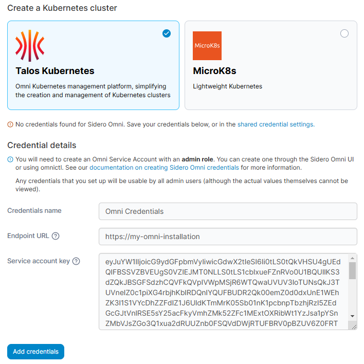
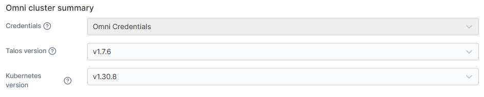
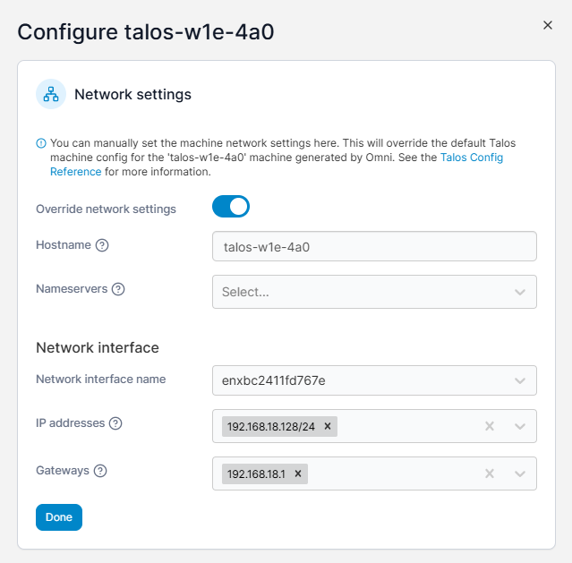
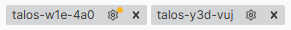
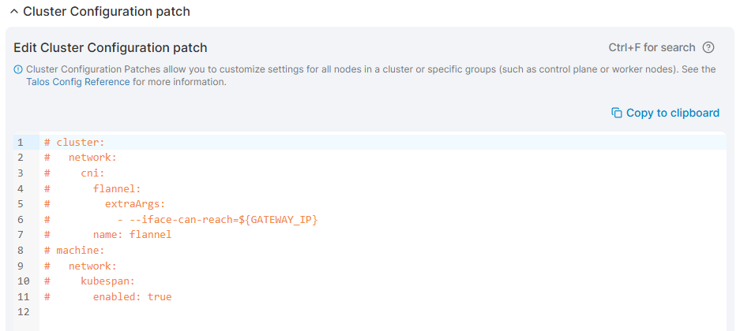
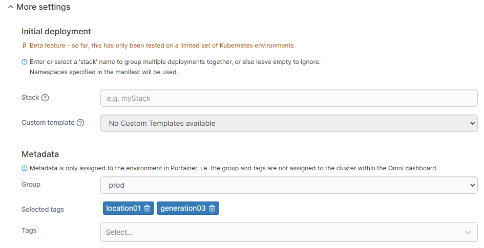

# Talos Kubernetes

## Introduction

Portainer consists of two elements, the _Portainer Server_ and the _Portainer Agent_. Both elements run as lightweight containers on Kubernetes. This document will outline how to create a Talos Kubernetes cluster via Omni and install the Portainer Edge Agent. If you do not have a working Portainer Server instance yet, please refer to the [Portainer Server installation guide](../../../../start/install/server/kubernetes/baremetal.md) first.

## Prerequisites

In order to connect to Omni and deploy a Talos Kubernetes cluster and the Portainer Edge Agent, you will need:

* An installation of Omni. You can use the [SaaS option](https://www.siderolabs.com/platform/saas-for-kubernetes/) or alternatively [self-host](https://omni.siderolabs.com/how-to-guides/self_hosted) an Omni installation. Note that while we believe that self-hosted installations will work fine, we have not extensively tested them in this initial release of this feature.
* A service account on your Omni installation for Portainer to use. This service account should have Admin access. You can learn more about how to create a service account in our [credentials documentation](../../../settings/credentials/omni.md).
* Machines registered within your Omni installation to be used for your Talos cluster. Documentation on registering these machines can be found in [Sidero's documentation](https://omni.siderolabs.com/how-to-guides/registering-machines).
* The machines you intend to use for your Talos Kubernetes cluster must be able to communicate with the Portainer Server deployment on API port (by default `9443`) and the tunnel server port (by default `8000`). This is so that the Edge Agent that is deployed on the cluster can communicate with the Portainer server.

## Deployment

To create your Talos Kubernetes cluster and deploy the Portainer Edge Agent to your machines, from the menu expand **Environment-related**, click **Environments**, then click **Add environment**.

<figure><figcaption></figcaption></figure>

Select **Create a Kubernetes cluster** and click **Start wizard**, then ensure **Talos Kubernetes** is selected.

If you have not yet [configured a set of credentials for your Omni installation](../../../settings/credentials/omni.md), you will be asked to provide them now. If you already have a credential set configured, you can skip to [cluster configuration](omni.md#configure-your-cluster).

### Credential details

Fill in the fields based on the table below:

| Field/Option        | Overview                                                                                                                       |
| ------------------- | ------------------------------------------------------------------------------------------------------------------------------ |
| Credentials name    | Enter a name for this credential set. This is how it will be listed in Portainer.                                              |
| Endpoint URL        | Enter the endpoint URL of your Omni installation. This is generally the same URL you would be using to access the Omni web UI. |
| Service account key | Paste your service account key into this field.                                                                                |


You can create a service account through the Omni web UI or using `omnictl`. You can find more information on how to do this in our [Omni credentials documentation](../../../settings/credentials/omni.md).


<figure><figcaption></figcaption></figure>

Once you have entered your credentials click **Add credentials**. The credential set will be saved under the name you entered, and you will be taken to the cluster configuration.

### Configure your cluster

Once you have a set of credentials configured, you can proceed to configuring your cluster. Enter a **Name** for your cluster and fill out the rest of the fields based on the tables below.

#### Portainer server details

Here you can provide the details for Portainer so that the agent can be deployed once the cluster has been created. Note that the URLs here should be the URLs that Portainer is accessible on from the perspective of the machines in the cluster.

| Field/Option                    | Overview                                                                                                   |
| ------------------------------- | ---------------------------------------------------------------------------------------------------------- |
| Portainer API server URL        | The URL to your Portainer server. This should generally be pre-populated with the correct value.           |
| Portainer tunnel server address | The address to the Portainer tunnel server. This should generally be pre-populated with the correct value. |

<figure><figcaption></figcaption></figure>

#### Omni cluster summary

Here you can select the credentials to use to connect to Omni as well as the versions of Talos and Kubernetes to deploy.

| Field/Option       | Overview                                                                                                                                             |
| ------------------ | ---------------------------------------------------------------------------------------------------------------------------------------------------- |
| Credentials        | Select the set of Omni credentials to use from the dropdown.                                                                                         |
| Talos version      | Select the version of Talos to deploy on your cluster machines. The options here may be limited by the machines you select later in the process.     |
| Kubernetes version | Select the version of Kubernetes to install on your cluster machines. The options here may be restricted based on the version of Talos chosen above. |

<figure><figcaption></figcaption></figure>

#### Cluster machines

Here you can specify the machines to use for your cluster. The dropdowns will display the list of available machines alongside any labels on each machine to help with identification.&#x20;

| Field/Option     | Overview                                                                                                                                                 |
| ---------------- | -------------------------------------------------------------------------------------------------------------------------------------------------------- |
| Control Plane    | Select the machine(s) to use as your control plane nodes. You will need to choose at least one, and an odd number of control plane nodes is recommended. |
| Main worker pool | Select the machine(s) to use as your worker nodes.                                                                                                       |

<figure><figcaption></figcaption></figure>

Once you have selected machines here you can tweak the networking configuration for each machine individually if necessary by clicking the cog icon next to the individual machine.

<figure><figcaption></figcaption></figure>

Machines that have had their networking configuration adjusted in this way will have an orange dot on the cog icon:

<figure><figcaption>
talos-w1e-4a0 has a modified network configuration whereas talos-y3d-vuj does not.
</figcaption></figure>

#### Cluster Configuration patch

This section allows you to apply a custom YAML configuration to your cluster if required. You can click **Cluster Configuration patch** to display the section and provide your YAML in the editor.

<figure><figcaption></figcaption></figure>

#### More settings

As an optional step you can expand the More settings section to customize the deployment further.

| Field/Option       | Overview                                                                                                                     |
| ------------------ | ---------------------------------------------------------------------------------------------------------------------------- |
| Initial deployment | This section lets you select a custom template to deploy after cluster creation.                                             |
| Stack              | Optionally enter a stack name for your initial deployment.                                                                   |
| Custom template    | Select the template to deploy from the dropdown.                                                                             |
| Metadata           | This section lets you specify metadata for the environment for use within Portainer.                                         |
| Group              | Select the group to add the environment to.                                                                                  |
| Tags               | Select the tags to apply to your environment. These tags apply only to Portainer, and not to the cluster within Omni itself. |

<figure><figcaption></figcaption></figure>

Once you have entered your cluster configuration details, click **Provision environment** to begin the provision. Portainer will start provisioning your cluster with the options you selected. If you have other environments to configure click **Next** to proceed, otherwise click **Close** to return to the list of environments.

### Provision progress

From the Environments page you will be able to see the progress of any running Kubernetes environment provisions. The status will be updated as the provision completes, and if the provision runs into problems an error will be displayed here. You can hover over the status or error for additional detail.

<figure><figcaption></figcaption></figure>

Once the provision completes, you will be able to access the environment as you would any other Portainer-configured environment.

