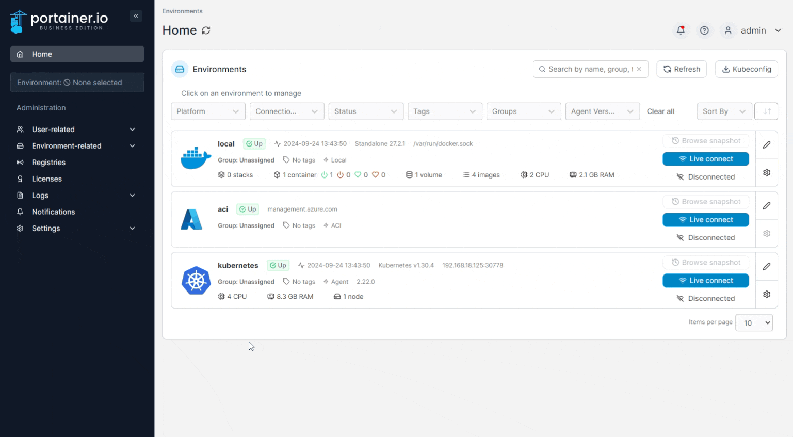
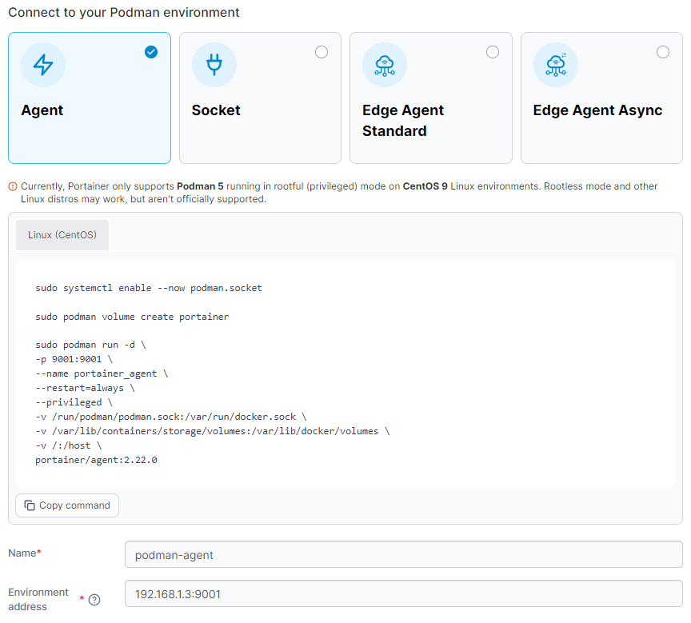

# Install Portainer Agent on Podman

Portainer uses the _Portainer Agent_ container to communicate with the _Portainer Server_ instance and provide access to the node's resources. This document will outline how to install the Portainer Agent on your node and how to connect to it from your Portainer Server instance. If you do not have a working Portainer Server instance yet, please refer to the [Portainer Server installation guide](../../../../start/install/server/docker/linux.md) first.

In addition to the generic requirements for Podman environments, you will need:

* Port `9001` accessible on this machine from the Portainer Server instance. If this is not available, we recommend using the [Edge Agent](../docker/edge.md) instead.

The Portainer Agent installation instructions also make the following additional assumptions about your environment:

* You are accessing Podman via Unix sockets. The Portainer Agent does not support connecting to the Podman engine via TCP.
*   You have not set a custom `AGENT_SECRET` on your Portainer Server instance. If you have (by specifying an `AGENT_SECRET` environment variable when starting the Portainer Server container), you will need to provide that same secret to your agent in the same way (as an environment variable) when deploying, for example by adding the following to your `podman run` command:

    `-e AGENT_SECRET=yoursecret`

From the menu expand **Environment-related**, click **Environments**, then click **Add environment**.

<figure><figcaption></figcaption></figure>

Next, select **Podman** as the environment type then click **Start Wizard**. Select the **Agent** option, then your environment type. Copy the commands and run them on your Podman instance.


If you want to use the [host management features](../../../../user/docker/host/setup.md#enable-host-management-features) of the Portainer Agent, you should add the necessary volume mount to the command that Portainer provides:

```
-v /:/host
```



If Podman on the environment you're deploying the Agent to has the Podman volume path at a non-standard location (instead of `/var/lib/containers/storage/volumes`) you will need to adjust the volume mount in the deployment command to suit.&#x20;

For example, if your volume path was `/srv/data/podman`, you would change the line in the command to:

```
- v /srv/data/podman:/var/lib/docker/volumes \
```

The right side of the mount should remain as `/var/lib/docker/volumes`, as that is what the Agent expects (even when using Podman).


Once the Agent has been deployed, enter the environment details using the table below as a guide:

| Field/Option        | Overview                                                                                                                                                                                                                                                                      |
| ------------------- | ----------------------------------------------------------------------------------------------------------------------------------------------------------------------------------------------------------------------------------------------------------------------------- |
| Name                | Give the environment a descriptive name.                                                                                                                                                                                                                                      |
| Environment address | Enter the DNS name or IP address to connect to the Portainer Agent along with the port (the default port is `9001`). Do not provide a protocol - communication with the Agent by the Server is performed over HTTPS with certificates generated by the Agent on installation. |

<figure><figcaption></figcaption></figure>

As an optional step you can expand the **More settings** section to categorize the environment by adding it to a [group](../../groups.md) or [tagging](../../tags.md) it for better searchability.

<figure><figcaption></figcaption></figure>

When you're ready, click **Connect**. If you have other environments to configure click **Next** to proceed, otherwise click **Close** to return to the list of environments.
