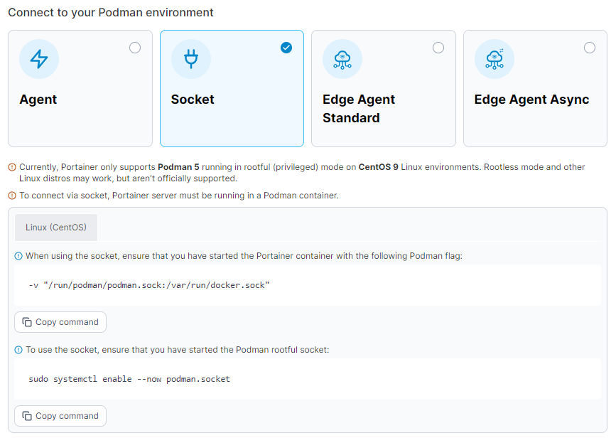
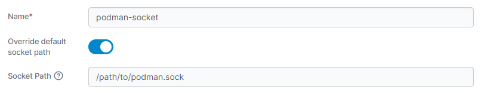

# Connect to the Podman Socket

Connecting to the Podman socket directly can only be done from the local environment. Before you begin, ensure the user running the Portainer Server container has permissions to access the Podman socket.

From the menu expand **Environment-related**, click **Environments**, then click **Add environment**.

<figure><figcaption></figcaption></figure>

Next, select **Podman** as the environment type then click **Start Wizard**. Select the **Socket** option and your platform. You will be shown the command required to ensure you have started the Podman socket.

<figure><figcaption></figcaption></figure>

Fill out the fields based on the table below.

<table><thead><tr><th width="280">Field/Option</th><th>Overview</th></tr></thead><tbody><tr><td>Name</td><td>Give the environment a descriptive name.</td></tr><tr><td>Override default socket path</td><td>Toggle this option on to override the default socket path.</td></tr><tr><td>Socket Path</td><td>If <strong>Override default socket path</strong> is enabled, enter the path to the Podman socket.</td></tr></tbody></table>

<figure><figcaption></figcaption></figure>

As an optional step you can expand the **More settings** section to categorize the environment by adding it to a [group](../../groups.md) or [tagging](../../tags.md) it for better searchability.

<figure><figcaption></figcaption></figure>

When you're ready, click **Connect**. If you have other environments to configure click **Next** to proceed, otherwise click **Close** to return to the list of environments.
