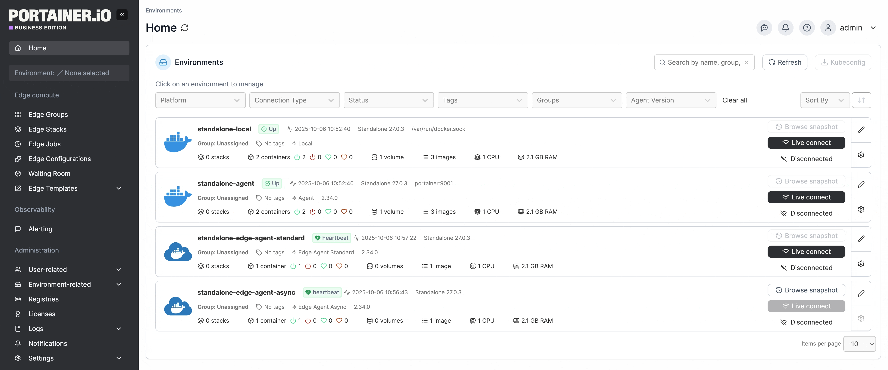
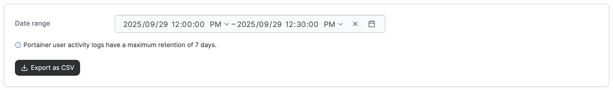

# Activity

Within the Portainer Business Edition UI you can view a log of all actions taken. The log is read-only and cannot be edited.

From the menu expand **Logs** then select **Activity**.

<figure><figcaption></figcaption></figure>

To filter logs, select the date range you want to view. You can optionally refine the time range by selecting the time fields and editing them. Once the desired range is specified, the activity logs will update automatically. You can also download the filtered logs by clicking **Export as CSV**.

<figure><figcaption></figcaption></figure>

Activity logs are searchable, and the date and time, user, endpoint, and action are provided for each.

<figure><figcaption></figcaption></figure>

You can also click **inspect** to inspect the activity's payload.

<figure><figcaption></figcaption></figure>
