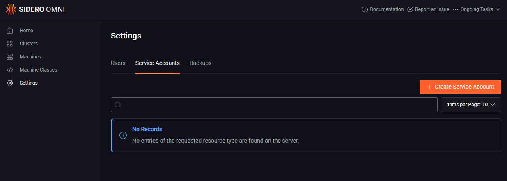
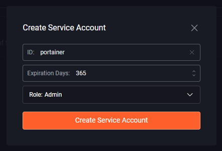
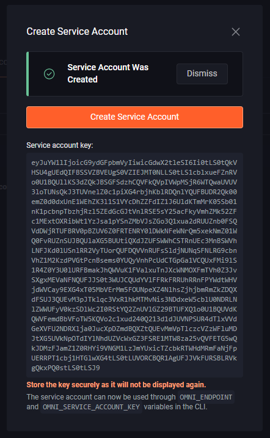
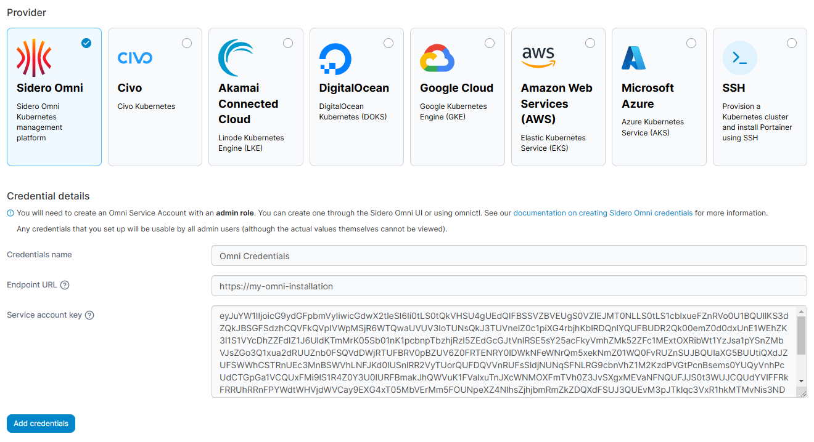

# Add Sidero Omni credentials

Before you can add your Sidero Omni credentials to Portainer, you will need to create a service account within Omni for Portainer to use. You can either do this via the Omni web UI, or via `omnictl`.

## Create a service account with the Omni web UI

To create a service account for Portainer through the Omni web UI, first log into the web UI with an administrator user. Once logged in, click on **Settings** then select the **Service Accounts** tab.

<figure><figcaption></figcaption></figure>

Next click the **Create Service Account** button and complete the fields as per the table below:

| Field/Option    | Overview                                                                                                            |
| --------------- | ------------------------------------------------------------------------------------------------------------------- |
| ID              | Enter an ID for the service account. We suggest something like `portainer`.                                         |
| Expiration Days | Set the number of days you want the service account to be valid for.                                                |
| Role            | Select the `Admin` role from the dropdown. Portainer needs Admin privileges in order to create and manage clusters. |


<figure><figcaption></figcaption></figure>

Once you have entered all the details click the **Create Service Account** button. The service account will be crated and you'll be shown the **Service account key**. Make a note of this key as it will not be shown again.

<figure><figcaption></figcaption></figure>

You can now proceed to [add your credentials](omni.md#adding-your-credentials).

## Create a service account with omnictl

To create a service account for Portainer using `omnictl`, you will first need an environment where `omnictl` is installed and configured to connect to your Omni installation with an Admin user. You can learn more on how to do this from [Sidero Omni's documentation](https://omni.siderolabs.com/how-to-guides/install-and-configure-omnictl).

Once you have `omnictl` installed and configured, you can run the following command to create a service account:

```
onictl serviceaccount create portainer
```

This will create a service account named `portainer` with a lifetime of 1 year and with the same role as the user that created it. The command will output the `OMNI_ENDPOINT` and `OMNI_SERVICE_ACCOUNT_KEY` values - note both of these as you will need them in the next step.

You can now proceed to [add your credentials](omni.md#adding-your-credentials).

## Adding your credentials

To add credentials for an Omni account, from the [Shared credentials](./) page click **Add credentials**, then select the **Sidero Omni** option. Give your credential set a **name** and paste your **Endpoint URL** and **Service account key** into the respective boxes.

<figure><figcaption></figcaption></figure>

When you're ready, click **Add credentials**. Your credentials will now be available to you when [creating an Omni Talos cluster](../../environments/add/kube-create/omni.md).
