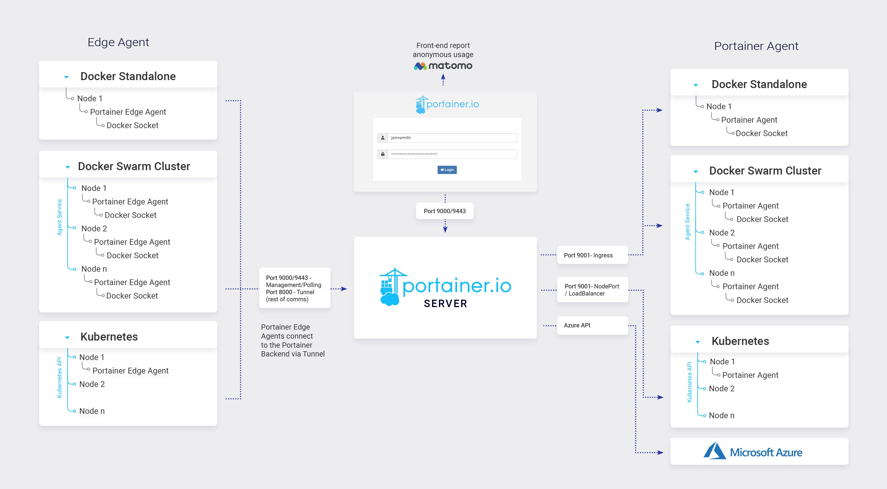

# What is Portainer's architecture?

Portainer consists of two elements: the Portainer Server and the Portainer Agent. Both run as lightweight containers on your existing containerized infrastructure. The Portainer Agent should be deployed to each node in your cluster and configured to report back to the Portainer Server container.\
A single Portainer Server will accept connections from any number of Portainer Agents, providing the ability to manage multiple clusters from one centralized interface. To do this, the Portainer Server container requires data persistence. The Portainer Agents are stateless, with data being shipped back to the Portainer Server container.

<figure><figcaption></figcaption></figure>

For a deeper dive into the architecture of Portainer, have a look at our [reference architecture](https://academy.portainer.io/architecture).
