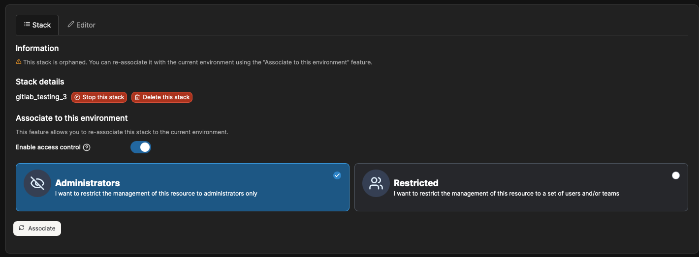

# How do I change the way I connect to an environment without losing my existing stacks?


Note that these steps apply to Docker environments only.


In the case of changing the way you connect to an environment (for example by moving from connecting to the Docker socket directly to using a socket proxy) you can move your stacks by:



### Removing the current environment connection in Portainer

Under **Administration**, navigate to **Environment-related**, then to **Environments**. Select the environment you would like to remove and click **Remove.** The stacks in this environment will become orphaned, and therefore available to be re-associated once you re-add the environment in the next step.

<figure><figcaption></figcaption></figure>



### Adding a new environment using the new connection method

[Add the environment again](../../admin/environments/add/) using the new connection method.



### Re-associating the orphaned stacks with the new environment

Within the environment that you want to associate your orphaned stacks with, click **Stacks** in the left hand menu. At the Stacks list, click on the three dots in the top right corner and select **Show all orphaned stacks**. Your stack list will then update to include any orphaned stacks.

<figure><figcaption></figcaption></figure>

Click into the stack that you want to recover, and select **Associate.**

<figure><figcaption></figcaption></figure>

Your stack will now appear in your stack list with total control. Repeat this process for each stack you want to re-associate.&#x20;



