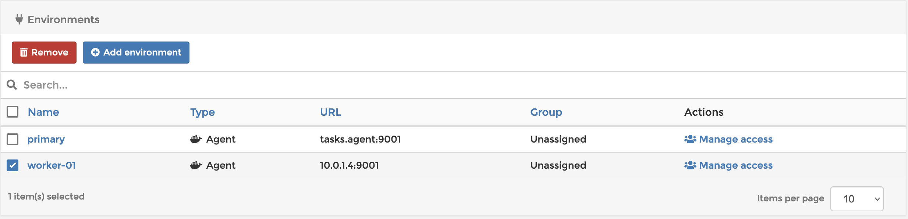

# Why is my node count higher than it should be?

Portainer is licensed on a per-node basis. A node is any container runtime managed by Portainer. For example:

* A Docker standalone instance would be one Portainer environment and count as one node as it would manage one container runtime. It would require **1** license.
* A Docker Swarm cluster would be one Portainer environment and count as the same number of nodes as are in the Docker Swarm cluster as it would manage that number of container runtimes. It would require a license for each of those nodes.
* A Kubernetes cluster, like a Docker Swarm cluster, would be one Portainer environment and count as the same number of nodes as are in the Kubernetes cluster as it would manage that number of container runtimes. It would require a license for each of those nodes.

***

Even knowing this, it is possible to create situations where your node count, and therefore license count, is higher than your number of nodes. This is usually the result of adding individual worker nodes in a cluster as additional environments in Portainer.

For example, if Portainer is managing a swarm consisting of one manager and three workers, **4** licenses are used.

<figure><figcaption></figcaption></figure>

<figure><figcaption></figcaption></figure>

This Portainer environment consists of the manager and all three worker nodes. There is no need to add anything else to Portainer in order to manager this entire cluster. The Portainer Agent is deployed to come up on every worker node, so when new workers come online, an instance of the Agent will be scheduled on them automatically and an additional license will be used.

If you mistakenly add one of the workers as a **new** environment in Portainer, Portainer will gladly talk to it, see that it is a cluster consisting of four nodes, and apply licensing accordingly.

<figure><figcaption></figcaption></figure>

<figure><figcaption></figcaption></figure>

As you can see, now that the worker has been added as another cluster, Portainer counts the nodes in the cluster and applies a license for each of them. This uses **8** licenses where only **4** licenses were needed. If this approach were to continue for all of the workers, **16** license would be used for a four node cluster.

If you find yourself in this situation, you can simply remove the extraneously added environments by clicking **Environments** in the navigation menu, then selecting the environment to be removed, and clicking the **Remove** button.

<figure><figcaption></figcaption></figure>

\
This will not affect the workloads running on the worker or the cluster. It will simply remove it from being seen by Portainer as a unique environment and adjust your licensing count appropriately.

