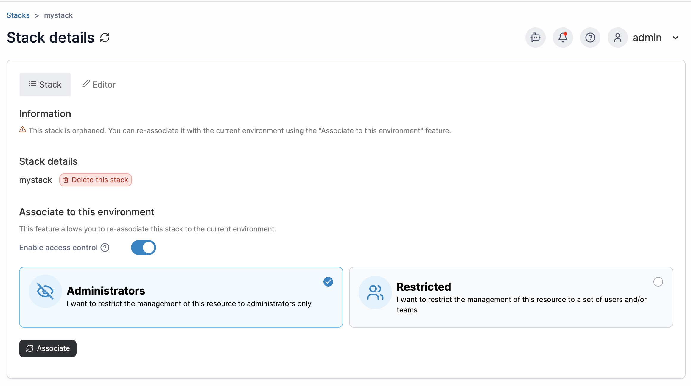

# How do I recover orphaned stacks from a previously deleted environment?

Stacks from an environment that has been deleted will be labelled as orphaned stacks. When a new environment has been created within the same node, the orphaned stacks can be re-associated by following the below steps.&#x20;

1. Within the environment that you want to associate your orphaned stacks with, click **Stacks** in the left hand menu. At the Stacks list, click on the three dots in the top right corner and select **Show all orphaned stacks**. Your stack list will then update to include any orphaned stacks.

<figure><figcaption></figcaption></figure>

2. Click into the stack that you want to recover, and select **Associate.**

<figure><figcaption></figcaption></figure>

Your stack will now appear in your stack list with total control. Repeat this process for each stack you want to reassociate.

