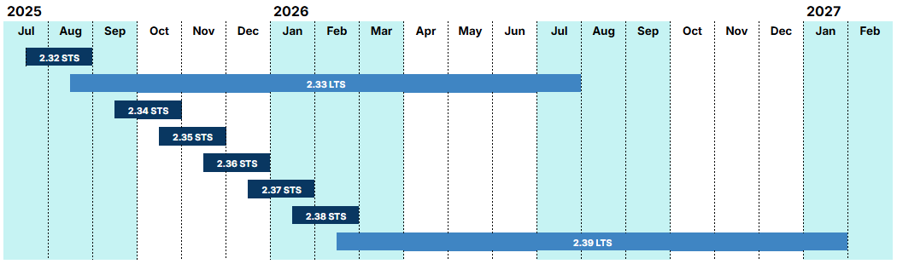

# Lifecycle policy

Portainer makes this policy public so customers and partners can effectively plan, deploy, and support their container management infrastructure effectively using Portainer. It is published in an effort to provide as much transparency as possible but Portainer has the discretion to make exceptions from this policy should that be in Portainer’s or our customer’s best interests.

Any release dates are provided for guidance only and the exact dates may change.

## The Portainer lifecycle

Portainer releases approximately follow a monthly cadence for minor releases (X.Y) which can introduce feature enhancements and new features but endeavor to maintain backward compatibility.

Micro or patch releases (X.Y.z) are released as needed and are limited to backward compatible bug fixes only.

Major versions (X) will be much less frequent, will include potential breaking changes, and may require an upgrade or migration process from previous versions.

All releases are cumulative - all previous enhancements and fixes are included in each release.

## Terminology

### Supported versus maintained

When we say “supported”, we are referring to the commercial support that is included with Portainer Business Edition subscriptions at the Scale and Enterprise level. This includes access to all STS and LTS releases and patches. Our [support terms](https://www.portainer.io/support-terms) have more detail on what is and isn’t covered by our support.

For Starter, Home & Student, our free Business Edition offerings, and our Community Edition, support is provided through our [community support channels](https://www.portainer.io/get-support-for-portainer).

The term “maintained” refers to the act of releasing updated versions of our releases, for example patches to resolve bugs or security issues. All editions of Business Edition and Community Edition will be maintained according to each release’s respective lifecycle.

Portainer always recommends updating to the latest version in the release stream to ensure you have the latest security fixes, bug fixes, and performance improvements. It is at Portainer’s discretion to backport fixes to any version outside of the supported version window.

### STS versus LTS

Portainer has two release streams, STS and LTS and it’s important you know the differences so you can choose accordingly.

#### **Short Term Support (STS) releases**

Short Term Support releases are identified with an “STS” suffix.

These are supported and maintained until the release of the next STS or LTS version. Use STS versions if you are interested in getting the latest features faster and don’t mind upgrading more frequently.

#### **Long Term Support (LTS) releases**

Long Term Support releases are identified with an “LTS” suffix.

These releases are supported and maintained until the release of the next LTS version plus a three month migration window so are more suitable for environments where adding new features on a frequent basis is less desirable.


Portainer LTS releases focus less on new features and more on stability so Portainer recommends LTS releases for production workloads.


## Current and planned releases

Each stream (LTS and STS) will have a number of patch releases throughout it’s life.

### Current releases

| Release      | Release Date | End of support/maintenance |
| ------------ | ------------ | -------------------------- |
| 2.27 LTS     | Feb 2025     | Jan 2026                   |
| 2.36 STS     | Nov 2025     | Dec 2025                   |
| **2.33 LTS** | **Aug 2025** | **Jul 2026**               |

### Planned releases

| Release      | Release Date | End of support/maintenance |
| ------------ | ------------ | -------------------------- |
| 2.37 STS     | Dec 2025     | Jan 2026                   |
| 2.38 STS     | Jan 2026     | Feb 2026                   |
| **2.39 LTS** | **Feb 2026** | **Jan 2027**               |

<figure><figcaption></figcaption></figure>

Sitting on an older release that is no longer maintained or supported is strongly discouraged and customers take full responsibility for doing so. Customers are strongly encouraged to ensure they are running the latest patch release for a given stream.

## Older releases that are no longer supported or maintained

The following releases have passed the end of support date and are no longer maintained or supported. If you are using one of these versions (or older), we recommend that you [update](upgrade/) as soon as possible.

| Release  | Release Date | End of support/maintenance |
| -------- | ------------ | -------------------------- |
| 2.17     | Feb 2023     | Apr 2023                   |
| 2.18     | Apr 2023     | Aug 2023                   |
| 2.19     | Aug 2023     | Aug 2024                   |
| 2.20 STS | Mar 2024     | Aug 2024                   |
| 2.22 STS | Sep 2024     | Oct 2024                   |
| 2.23 STS | Oct 2024     | Nov 2024                   |
| 2.24 STS | Nov 2024     | Dec 2024                   |
| 2.25 STS | Dec 2024     | Jan 2025                   |
| 2.26 STS | Jan 2025     | Feb 2025                   |
| 2.28 STS | Mar 2025     | Apr 2025                   |
| 2.29 STS | Apr 2025     | May 2025                   |
| 2.30 STS | May 2025     | Jun 2025                   |
| 2.31 STS | Jun 2025     | Jul 2025                   |
| 2.32 STS | Jul 2025     | Aug 2025                   |
| 2.34 STS | Sep 2025     | Oct 2025                   |
| 2.35 STS | Oct 2025     | Nov 2025                   |

## Notes

Portainer uses the [semantic versioning scheme](https://semver.org/) and while Portainer endeavors to follow best practices, we reserve the right to make exceptions should that be in Portainer’s and our customer’s best interests.

For information on the available options and best practices for updating Portainer deployments, [refer to our update documentation](upgrade/).


[requirements-and-prerequisites.md](requirements-and-prerequisites.md)


