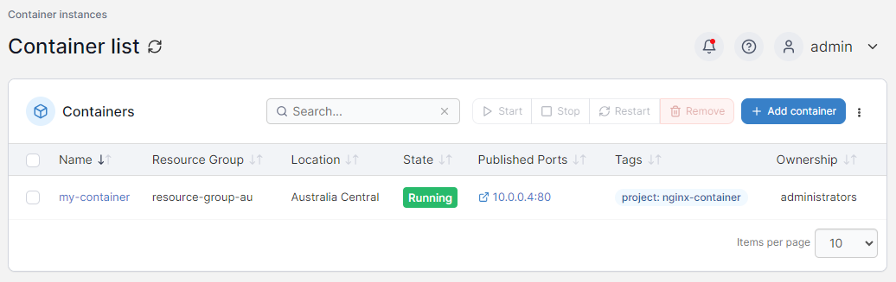

# Container instances

The **Container Instances** page allows you to interact with containers in your Azure application, letting you add and remove containers as needed.

<figure><figcaption></figcaption></figure>

You can click on a container name to view details about that container.


[details.md](details.md)


From this page you can add a new container or remove existing containers:


[add.md](add.md)



[remove.md](remove.md)


 
