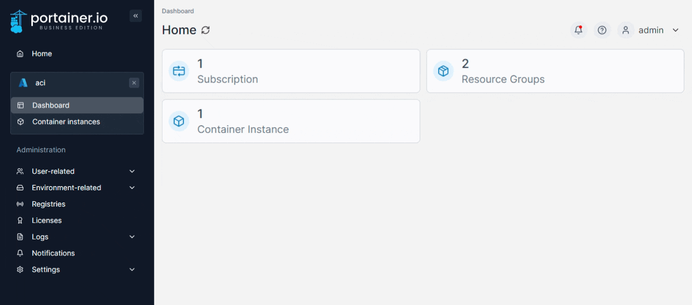
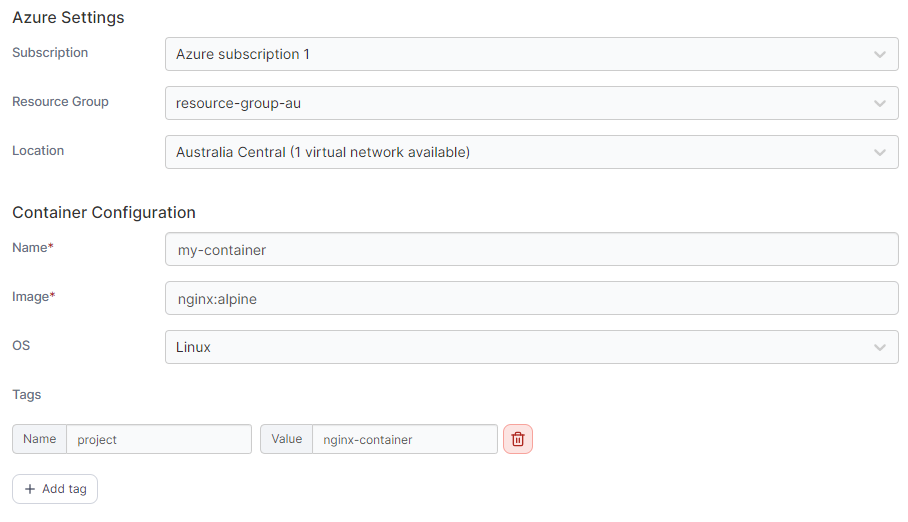
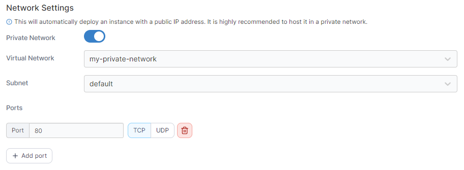
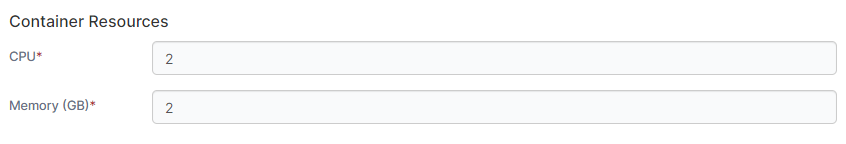
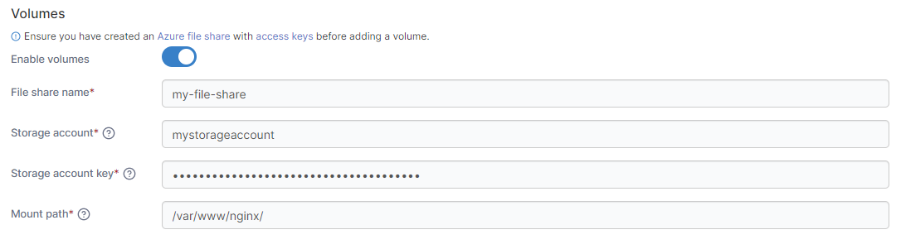
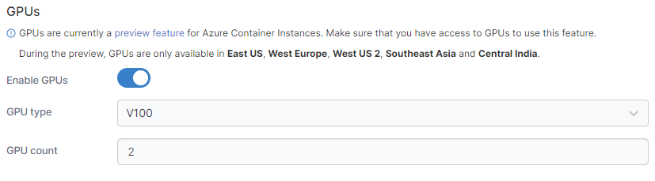

# Add a new container

From the menu select **Container instances** then click **Add container**.

<figure><figcaption></figcaption></figure>

Complete the configuration, using the table below as a guide:

| Field/Option   | Overview                                                                                                                                                       |
| -------------- | -------------------------------------------------------------------------------------------------------------------------------------------------------------- |
| Subscription   | Select the subscription you want to use for the container.                                                                                                     |
| Resource group | If two or more resource groups exist, select the resource group to use.                                                                                        |
| Location       | Select which Azure datacenter to run the container in. If virtual networks are available in a location, a count will be displayed alongside the location name. |
| Name           | Give the container a descriptive name.                                                                                                                         |
| Image          | Enter the name of the image that will be used to deploy the container.                                                                                         |
| OS             | Select the OS (typically Linux or Windows).                                                                                                                    |
| Tags           | Click **Add tag** to add a new tag, and provide the **Name** and **Value** for each tag as needed. Click the trash icon next to a tag to remove it.            |

<figure><figcaption></figcaption></figure>

### Network Settings

In this section you can configure the network for your container as well as the ports to publish.

| Field/Option    | Overview                                                                                                                                              |
| --------------- | ----------------------------------------------------------------------------------------------------------------------------------------------------- |
| Private Network | Toggle this option on if you wish to use a pre-existing private network for your container.                                                           |
| Virtual Network | When Private Network is enabled, select the network to use. The selection will be limited on what is available in your selected location.             |
| Subnet          | When Private Network is enabled, select the subnet to use within your network (where relevant).                                                       |
| Ports           | Enter the port number and select TCP or UDP to publish your container on the specified port and protocol. Click Add port to publish additional ports. |

<figure><figcaption></figcaption></figure>

### Container Resources

Here you can specify the resources available to your container.

| Field/Option | Overview                                                   |
| ------------ | ---------------------------------------------------------- |
| CPU          | Define how many CPUs to allocate to the container.         |
| Memory (GB)  | Define how much memory in GB to allocate to the container. |

<figure><figcaption></figcaption></figure>

### Volumes

This section lets you specify a volume you want to be accessible from the container.

| Field/Option        | Overview                                                             |
| ------------------- | -------------------------------------------------------------------- |
| Enable volumes      | Toggle this option on to enable adding a volume to this container.   |
| File share name     | Enter the file share name for the volume.                            |
| Storage account     | Enter the name of the storage account with access to the file share. |
| Storage account key | Enter the key for the above storage account.                         |
| Mount path          | Enter the path within the container to mount the volume.             |

<figure><figcaption></figcaption></figure>

### GPUs

Here you can enable GPU support for the container and specify the GPU to use.


GPUs are currently a preview feature for Azure Container Instances and only available in select locations. Ensure you have access to GPUs before using this feature.


| Field/Option | Overview                                                 |
| ------------ | -------------------------------------------------------- |
| Enable GPUs  | Toggle this on to enable GPU support for this container. |
| GPU type     | Select the type of GPU to use.                           |
| GPU count    | Enter the number of GPUs to use.                         |

<figure><figcaption></figcaption></figure>

When you're ready, click **Deploy the container**. When the deployment has finished, you'll see it in the list of  Azure container instances.
