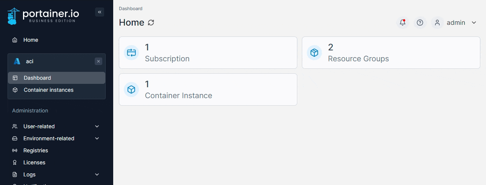
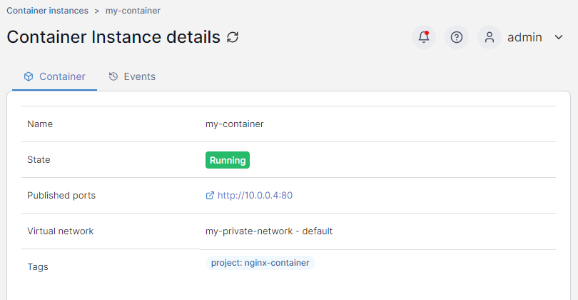
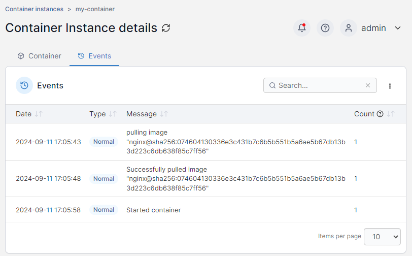
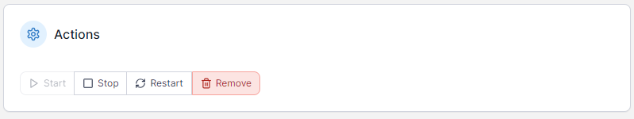
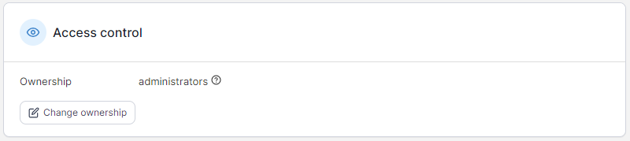

# View container details

To view the details of an existing container, from the **Container instances** list click the container's name.

<figure><figcaption></figcaption></figure>

### Container

The Container Instance details page displays information about the selected container under the **Container** tab.&#x20;

<figure><figcaption></figcaption></figure>

### Events

You can view past events in the container's lifecycle in the **Events** tab.

<figure><figcaption></figcaption></figure>

Events can be sorted by date, type, message and count (the number of times the event has fired) and can be filtered from the search box.

### Actions

From this section you can start, stop, restart or remove your container.

<figure><figcaption></figcaption></figure>

### Access control

This section shows the current ownership and access for the container and allows you to change it.

<figure><figcaption></figcaption></figure>
