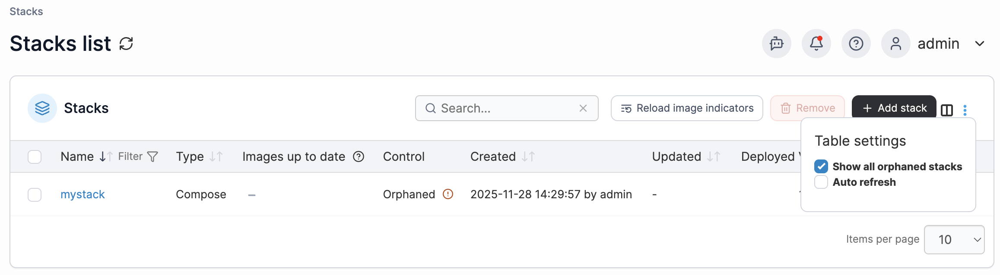

# Stacks

A stack is a collection of services, usually related to one application or usage. For example, a WordPress stack definition may include a web server container (such as nginx) and a database container (such as MySQL).

<figure><figcaption></figcaption></figure>

Within the Stack list, you’ll see all stacks that have been previously created in the selected environment. If an environment is deleted, any stacks that belonged to it become orphaned. To display any orphaned stacks, click the three dots in the top right corner and select **Show all orphaned stacks**, [the stack will need to be re-associated](../../../faqs/troubleshooting/stacks-deployments-and-updates/how-do-i-recover-orphaned-stacks-from-a-previously-deleted-environment.md) to be fully recovered.

<figure><figcaption></figcaption></figure>

When the [new image indicator](../host/setup.md#other) feature is enabled, the **Images up to date** column indicates whether the local images in the stack are up to date, with a green tick indicating they are up to date and an orange cross indicating that there is a newer version of an image available at the remote registry. A grey hyphen indicates Portainer was unable to determine whether there is an update available for the images.

You can click the **Reload image indicators** button to recheck the images for your stacks for updates, or to recheck a single stack's images you can click the image indicator icon for that stack.

For more on how this works, have a look at [this article](../../../faqs/troubleshooting/stacks-deployments-and-updates/how-does-the-image-update-notification-icon-work.md).


[add.md](add.md)



[edit.md](edit.md)



[template.md](template.md)



[webhooks.md](webhooks.md)



[migrate.md](migrate.md)



[remove.md](remove.md)

