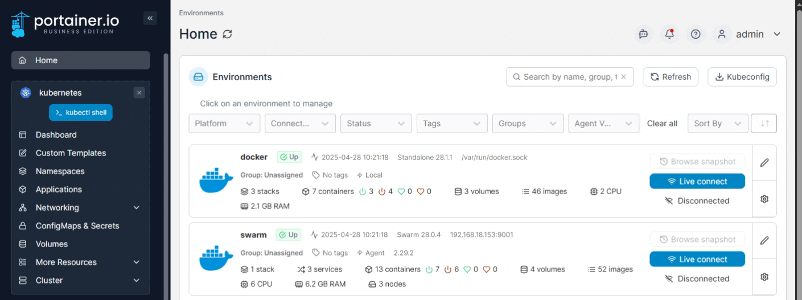
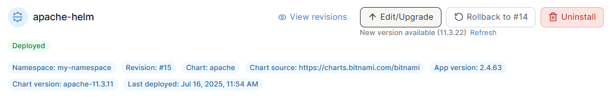
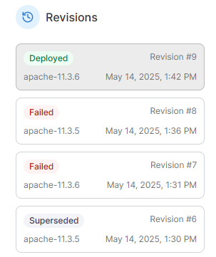
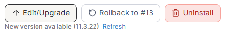
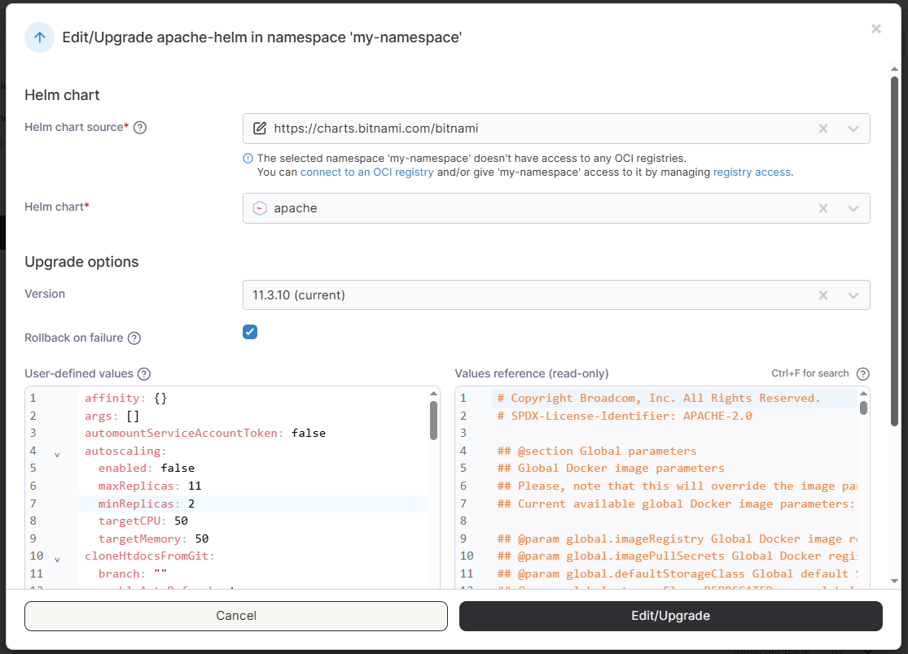
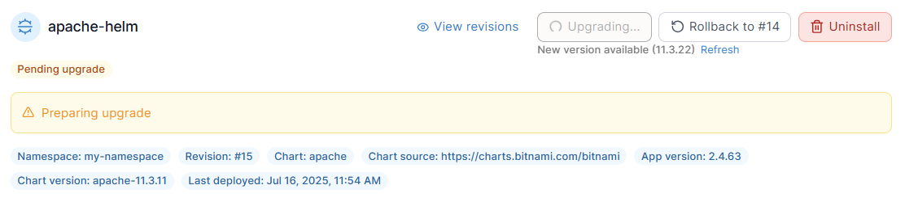
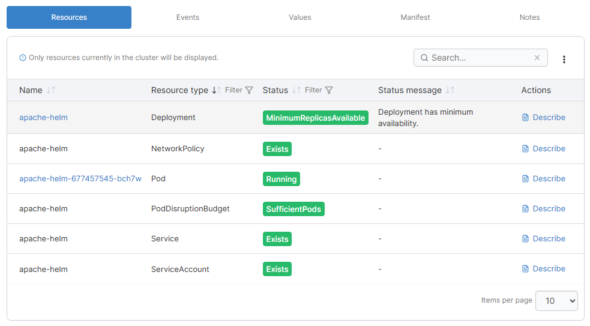
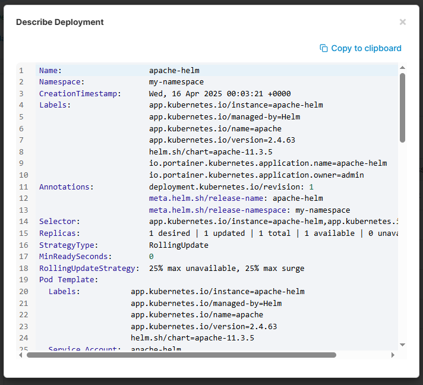
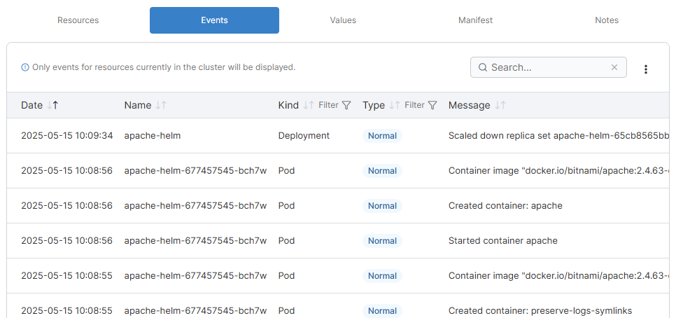
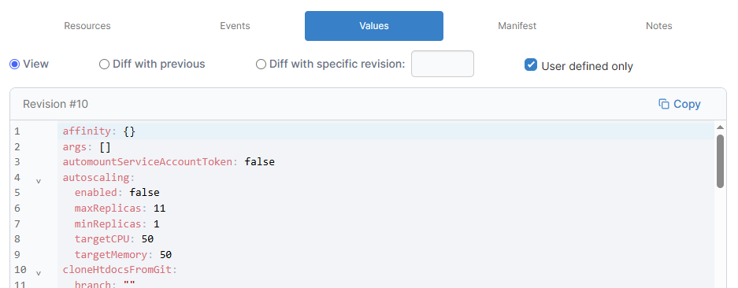

# Inspect a Helm application

To view information about Helm applications running in a cluster, from the menu select **Applications** then select the Helm application you want to inspect.

<figure><figcaption></figcaption></figure>

You will be shown details about the Helm application including the name, namespace, revision, chart used for the deployment, the chart source, the application version, the chart version, and the last deployment date. You'll also find buttons to [edit or upgrade](inspect-helm.md#upgrading), roll back or uninstall your Helm deployment.

<figure><figcaption></figcaption></figure>

## Revisions

On the right side of the page you will also see a list of revisions for your Helm deployment.


On smaller displays the revisions list is hidden by default - click the View revisions link to display them.


<figure><figcaption></figcaption></figure>

Revisions can be used to roll back your deployment to a previous state if something goes wrong. To rollback to a specific revision, select the revision from the sidebar and then click the **Rollback** button.

## Editing or Upgrading

With Helm chart versioning, a Helm deployment can be upgraded or downgraded through Portainer. If a newer version of your currently deployed chart is available, a new version notification will be displayed on under the Upgrade button. You can click the **Refresh** link to update the list of versions from the chart source.

<figure><figcaption></figcaption></figure>

To make changes to, upgrade, or downgrade a Helm deployment, click on the **Edit/Upgrade** button. In the resulting popup, choose the chart version to switch to (your current version will be labeled) and make any adjustments to the values. The default values for the version you have chosen is displayed on the right as a read-only reference. You can also choose whether to **Rollback on failure** by checking the box.

<figure><figcaption></figcaption></figure>

When you're ready, click **Edit/Upgrade**. The upgrade will begin and you will be returned to the details page for the application.

The status of the upgrade will be displayed on the details page and you can check the **Events** tab for details.

<figure><figcaption></figcaption></figure>

## Deployment details

You will also see five tabs that provide additional information about your Helm deployment: [Resources](inspect-helm.md#resources), [Events](inspect-helm.md#events), [Values](inspect-helm.md#values), [Manifest](inspect-helm.md#manifest) and [Notes](inspect-helm.md#notes).

### Resources

The **Resources** tab displays information about the resources that make up your Helm deployment. The items listed here will vary depending on the contents of your Helm chart. The **Name**, **Resource type**, **Status**, **Status message** and **Actions** are shown for each resource.


Only resources currently in the cluster will be displayed on this tab.


<figure><figcaption></figcaption></figure>

Click on the name of select resource types (such as Deployments and Pods) to [view details of that specific resource](inspect.md). Clicking the **Describe** link for a resource will display a raw description of the resource in a popup window.

<figure><figcaption></figcaption></figure>

### Events

The **Events** tab lists the events related to the deployment of this application. Events listed here are relative to the events TTL setting on the underlying Kubernetes environment, so will disappear after some time.


Only events for resources currently in the cluster will be displayed on this tab.


<figure><figcaption></figcaption></figure>

### Values

The **Values** tab shows the raw values set on the deployment. By default the **View** option is selected which shows the currently deployed values, but choosing **Diff with previous** or **Diff with specific revision** (and specifying a revision) lets you compare the currently deployed values with those of a previous revision. You can check the **User defined only** option to display only those options explicitly specified by the chart, or untick it to show all values including globally set options.

<figure><figcaption></figcaption></figure>

### Manifest

The **Manifest** tab displays the raw manifest used to deploy the Helm chart. By default the **View** option is selected which shows the currently deployed manifest, but choosing **Diff with previous** or **Diff with specific revision** (and specifying a revision) lets you compare the currently deployed manifest with that of a previous revision.

<figure><figcaption></figcaption></figure>

### Notes

The **Notes** tab displays any notes that were attached to the Helm chart when it was deployed. By default the **View** option is selected which shows the currently deployed notes, but choosing **Diff with previous** or **Diff with specific revision** (and specifying a revision) lets you compare the currently deployed notes with those of a previous revision.

<figure><figcaption></figcaption></figure>
