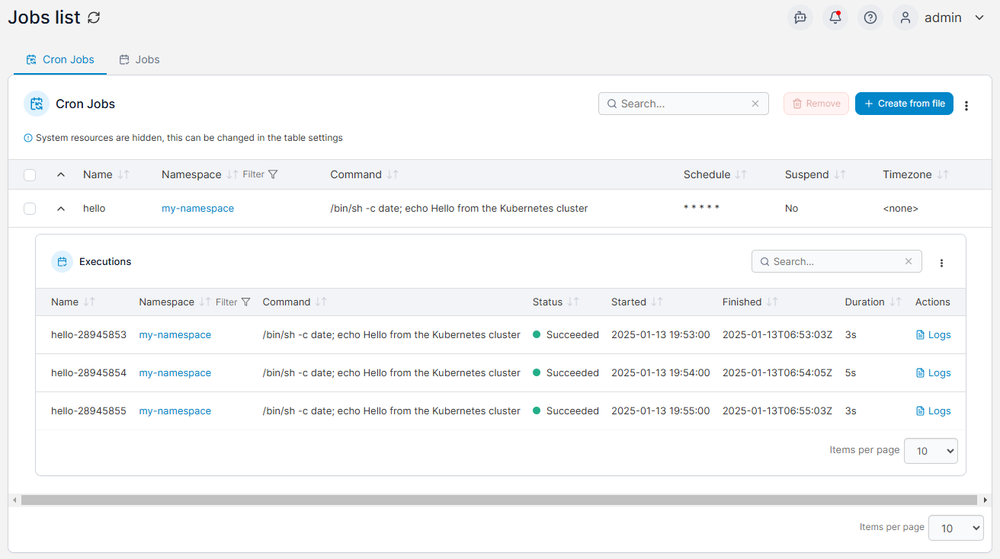

# Cron Jobs & Jobs

This section lists the Cron Jobs and Kubernetes Jobs on your Kubernetes cluster. New cron jobs and Kubernetes Jobs can be created via the **Create from file** button.

Select the relevant tab to switch between Cron Jobs and Jobs.

## Cron Jobs

The list of cron jobs can be sorted by any of the columns and filtered by Namespace, and can be expanded to view the executions for each cron job where you can see the status, start and finish times, duration, and view the logs for the execution by clicking **Logs**. To remove a cron job, check the box next to the cron job you want to remove then click the **Remove** button.

<figure><figcaption></figcaption></figure>

## Jobs

The list of Kubernetes Jobs can be sorted by any of the columns and filtered by namespace, and the logs for Jobs can be listed by clicking **Logs**. To remove a Job, check the box next to the Job you want to remove then click the **Remove** button.

<figure><figcaption></figcaption></figure>

