# Alerting


This section is only available in Portainer Business Edition and only accessible by administrator users.


On the Alerting page you can configure alerts for events related to your environments and for Portainer itself. Alerts will display on the Alerting page and notifications can be sent via Slack or Microsoft Teams integration, via email, or by triggering a webhook.


This feature is experimental and we recommend using this in non-production or test environments only at present as there may be unstable and evolving behavior.


To access Alerting once the feature is enabled under [experimental features,](../../admin/settings/general.md#experimental-features) click on **Alerting** under **Observability** in the left menu.

<figure><figcaption></figcaption></figure>

## Active Alerts

This tab shows any active alerts on your environments.

| Field/Option | Overview                                                                                                                                                                                                                                                                                                                                                                                                                                    |
| ------------ | ------------------------------------------------------------------------------------------------------------------------------------------------------------------------------------------------------------------------------------------------------------------------------------------------------------------------------------------------------------------------------------------------------------------------------------------- |
| Alert Name   | The name of the alert that has been triggered, along with the environments that triggered the alert (where relevant).                                                                                                                                                                                                                                                                                                                       |
| State        | 
The state of the active alert. This can be one of the following: <strong>Active:</strong> The alert is currently active and firing. <strong>Firing:</strong> The alert rule is currently firing and has triggered alerts. <strong>Inactive:</strong> The alert rule is not currently firing and has not triggered alerts. <strong>Pending:</strong> The alert rule is currently firing but has not yet triggered alerts.
 |
| Severity     | The severity level of the alert. This will depend on the severity level selected on the corresponding rule (where configurable).                                                                                                                                                                                                                                                                                                            |
| Message      | The message sent along with the alert.                                                                                                                                                                                                                                                                                                                                                                                                      |
| Source       | The source of the alert.                                                                                                                                                                                                                                                                                                                                                                                                                    |
| Instance     | The instance that has sent the alert.                                                                                                                                                                                                                                                                                                                                                                                                       |
| Started At   | The date and time the active alert began.                                                                                                                                                                                                                                                                                                                                                                                                   |
| Last Updated | The date and time the alert status was last updated.                                                                                                                                                                                                                                                                                                                                                                                        |
| Receivers    | The receiver that acts upon the alert. At present only the `default` receiver is available.                                                                                                                                                                                                                                                                                                                                                 |
| Actions      | Actions you can perform on the alert. You can click **Silence** to silence the alert.                                                                                                                                                                                                                                                                                                                                                       |

<figure>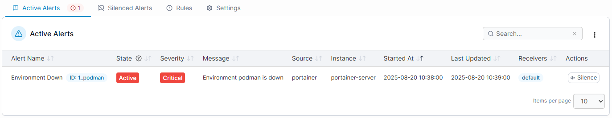<figcaption></figcaption></figure>

### Silence an alert

You can choose to temporarily silence an alert, for example when you are aware of the issue and are working to resolve it but do not need ongoing notifications while you do. To silence an alert, click the **Silence** button in the **Actions** column then complete the form.

| Field/Option | Overview                                                                  |
| ------------ | ------------------------------------------------------------------------- |
| Comment      | Specify a comment to associate with the silencing action.                 |
| Created By   | The user that silenced the alert. By default this contains your username. |
| Starts At    | The start date and time of the silencing.                                 |
| Ends At      | The end date and time of the silencing.                                   |
| Matchers     | A list of the criteria this silencing action will match.                  |

<figure>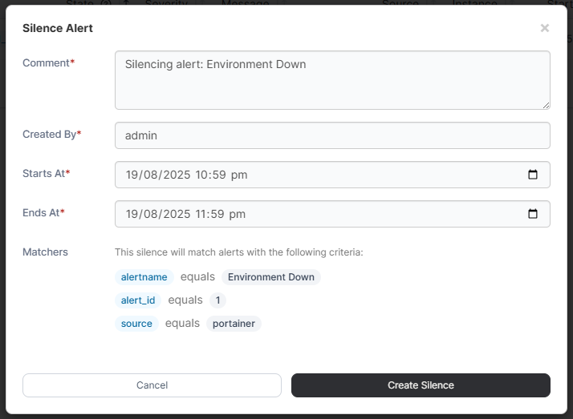<figcaption></figcaption></figure>

Once you're ready, click the **Create Silence** button.

## Silenced Alerts

This tab lists any silenced alerts. Silenced alerts are active alerts that have been temporarily silenced and will not notify.

| Field/Option | Overview                                                                                                                                                                                          |
| ------------ | ------------------------------------------------------------------------------------------------------------------------------------------------------------------------------------------------- |
| Alert Rule   | The name of the rule that has been silenced.                                                                                                                                                      |
| Comment      | The comment provided when silencing the alert.                                                                                                                                                    |
| Created By   | The user that created the silencing.                                                                                                                                                              |
| Starts At    | The start date and time of the silencing.                                                                                                                                                         |
| Ends At      | The end date and time of the silencing.                                                                                                                                                           |
| Status       | The status of the silencing. The `active` status indicates the silence is currently active. The `expired` status indicates the silence is no longer active due to the Ends At time having passed. |
| Actions      | Click the trash icon to remove the silencing. If the alert is still active it will return to Active Alerts.                                                                                       |

<figure>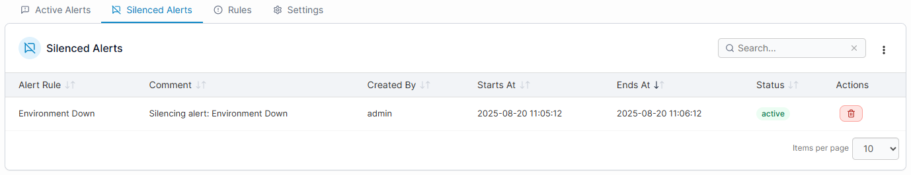<figcaption></figcaption></figure>

## Rules

The rules tab is where you define the rules that can be used to trigger alerts.


At present the list of rules is limited. We plan to extend the available rules here in future releases.


| Field/Option   | Overview                                                                                                                                                                         |
| -------------- | -------------------------------------------------------------------------------------------------------------------------------------------------------------------------------- |
| Alert Rule     | The name of the alert rule, along with labels that determine the type of rule, environment types it applies to, and any Portainer version restrictions for the rule to function. |
| Actions        | Here you can enable the rule using the toggle, and where relevant click Edit to customize the rule settings.                                                                     |
| Description    | The description of the rule.                                                                                                                                                     |
| Severity       | The severity level of the rule.                                                                                                                                                  |
| Threshold      | The threshold at which the rule will trigger. Depending on the rule this could be the number of consecutive failures or a specific value being reached or exceeded.              |
| Condition      | The comparison operator used in the condition trigger, for example equals or greater than.                                                                                       |
| Duration (min) | The period (in minutes) within which the condition and threshold must be true for the rule to be triggered. For rules where this isn't relevant, a dash is listed.               |
| Created At     | The creation date and time of the rule.                                                                                                                                          |

<figure>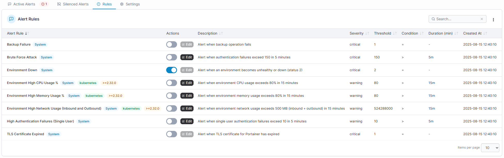<figcaption></figcaption></figure>

### Editing a rule

Some rules can be edited to suit your needs. To edit an editable rule, click the **Edit** button for the rule in the **Actions** column.


For system rules, some fields may be restricted from modification.


The following fields are available:

| Field/Option       | Overview                                                                                                                                                            |
| ------------------ | ------------------------------------------------------------------------------------------------------------------------------------------------------------------- |
| Name               | The name of the rule.                                                                                                                                               |
| Description        | The description of the rule.                                                                                                                                        |
| Threshold          | The threshold at which the rule will trigger. Depending on the rule this could be the number of consecutive failures or a specific value being reached or exceeded. |
| Condition operator | The comparison operator used in the condition trigger, for example equals or greater than.                                                                          |
| Duration           | The period within which the condition and threshold must be true for the rule to be triggered. For rules where this isn't relevant, a dash is listed.               |
| Severity           | The severity level of the rule.                                                                                                                                     |
| Enabled            | When toggled on, the rule is enabled.                                                                                                                               |

<figure><figcaption></figcaption></figure>

When you have made your changes, click **Save Rule**.

## Settings

This tab lists the alert manager instances used for sending notifications and is where you configure those notifications.


At present only the `internal` instance is available.


The following fields are displayed:

| Field/Option | Overview                                                                                                                                    |
| ------------ | ------------------------------------------------------------------------------------------------------------------------------------------- |
| Name         | The name of the alert manager instance.                                                                                                     |
| Status       | The connection status of the alert manager instance.                                                                                        |
| Enabled      | Whether the instance is enabled.                                                                                                            |
| Channels     | The number of notification channels configured in the instance.                                                                             |
| Actions      | Click Test to test whether the instance is reachable. Click Edit to make changes to the instance configuration and to set up notifications. |

<figure>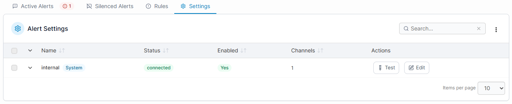<figcaption></figcaption></figure>

### Edit an instance

To edit an alert manager instance, click the **Edit** button for the instance in the **Actions** column. Here you can see the Name of the instance and enable or disable it through the toggle. You will also see any notification channels you have added listed here.

<figure>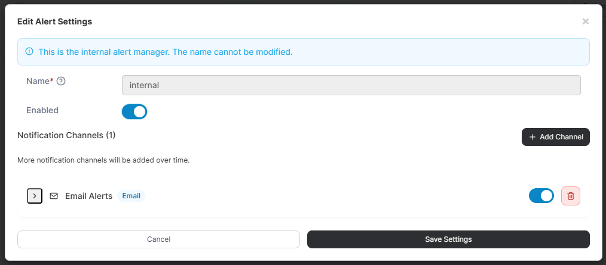<figcaption></figcaption></figure>

## Add a notification channel

To add a notification channel to an alert manager instance, on the **Settings** tab click the **Edit** button next to the instance, then click the **Add Channel** button. In the **New Channel** section, complete the fields as required.

First select the **Notification Type** from the dropdown. Current options are:

* [Slack](alerting.md#slack)
* [Email](alerting.md#email)
* [Webhook](alerting.md#webhook)
* [Microsoft Teams V2](alerting.md#microsoft-teams-v2)

The subsequent options will depend on the selected type.

<figure>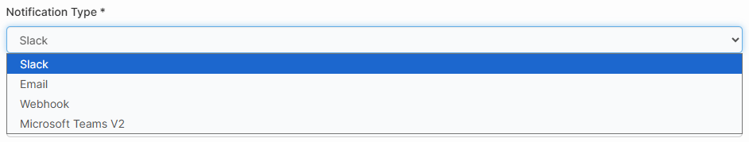<figcaption></figcaption></figure>

### Slack

The following options are available when configuring a Slack notification channel:

| Field/Option | Overview                                                                                                                                                                     |
| ------------ | ---------------------------------------------------------------------------------------------------------------------------------------------------------------------------- |
| Name         | Specify a name for your notification channel.                                                                                                                                |
| Webhook URL  | Enter the webhook URL for your Slack integration. You can learn more about how to configure this [in the Slack API documentation](https://api.slack.com/messaging/webhooks). |

<figure>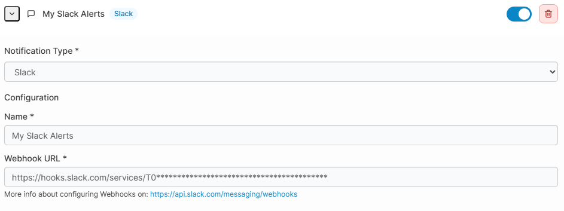<figcaption></figcaption></figure>

When you have completed the configuration, click **Save Settings**.

### Email

The following options are available when configuring an email notification channel:

| Field/Option       | Overview                                                                                                |
| ------------------ | ------------------------------------------------------------------------------------------------------- |
| Name               | Specify a name for your notification channel.                                                           |
| SMTP Server        | Enter the URL and port for your SMTP server. If no port is provided, the default of `587` will be used. |
| SMTP Auth Username | Enter the username for authenticating with your SMTP server.                                            |
| SMTP Auth Password | Enter the password for authenticating with your SMTP server.                                            |
| Require TLS        | If your SMTP server requires TLS, toggle this option on.                                                |
| To Email Address   | Enter the email address you want to send notifications to.                                              |
| From Email Address | Enter the email address that will appear as the sender for your notification emails.                    |

<figure>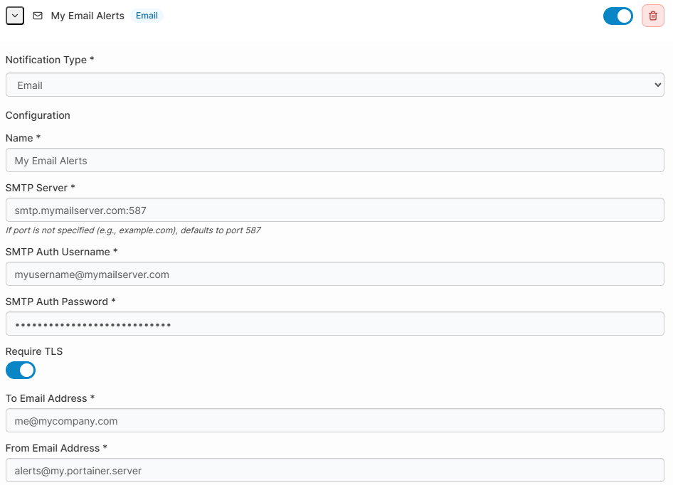<figcaption></figcaption></figure>

When you have completed the configuration, click **Save Settings**.

### Webhook

The following options are available when configuring a webhook notification channel:

| Field/Option | Overview                                      |
| ------------ | --------------------------------------------- |
| Name         | Specify a name for your notification channel. |
| Webhook URL  | Enter the URL for your webhook.               |

<figure>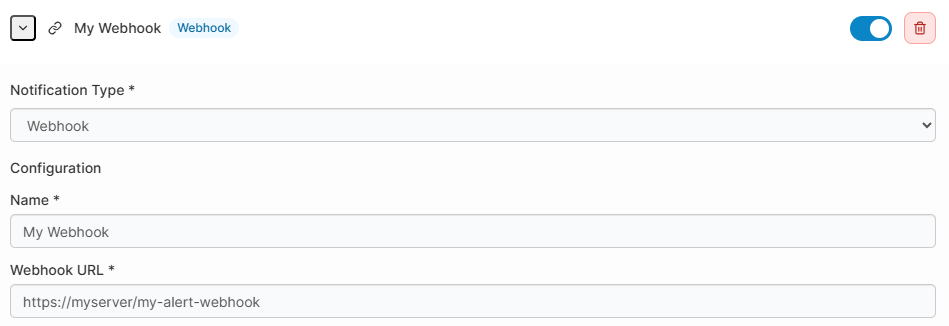<figcaption></figcaption></figure>

When you have completed the configuration, click **Save Settings**.

### Microsoft Teams V2

The following options are available when configuring a Microsoft Teams V2 notification channel:

| Field/Option | Overview                                                                                                                                                                                                                                                                  |
| ------------ | ------------------------------------------------------------------------------------------------------------------------------------------------------------------------------------------------------------------------------------------------------------------------- |
| Name         | Specify a name for your notification channel.                                                                                                                                                                                                                             |
| Webhook URL  | Enter the webhook URL for your Microsoft Teams integration. You can learn more about configuring Microsoft Teams webhooks [in the Microsoft documentation](https://docs.microsoft.com/en-us/microsoftteams/platform/webhooks-and-connectors/how-to/add-incoming-webhook). |

<figure>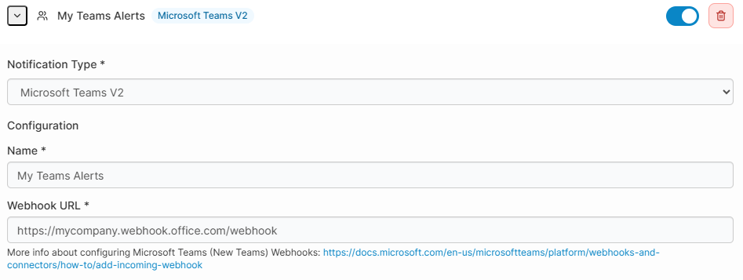<figcaption></figcaption></figure>

When you have completed the configuration, click **Save Settings**.
