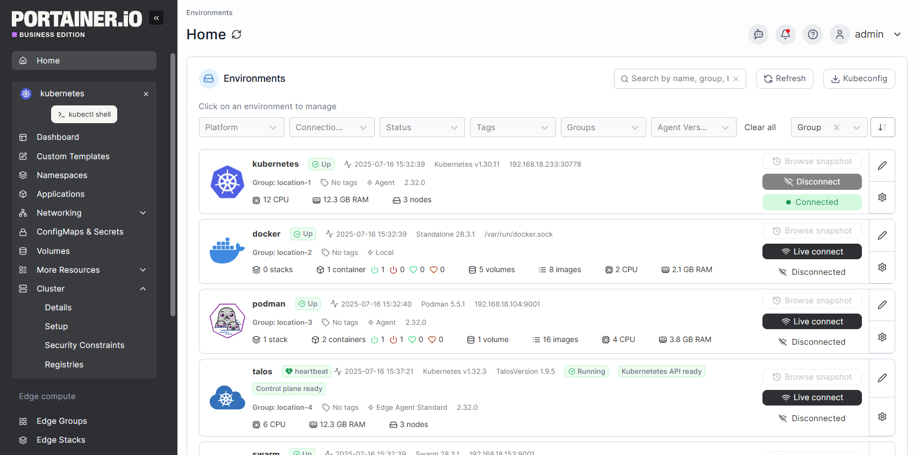
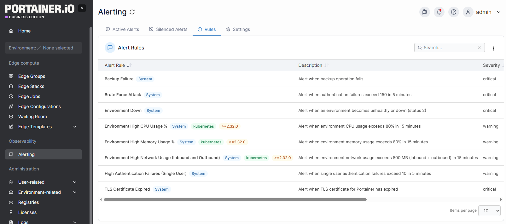
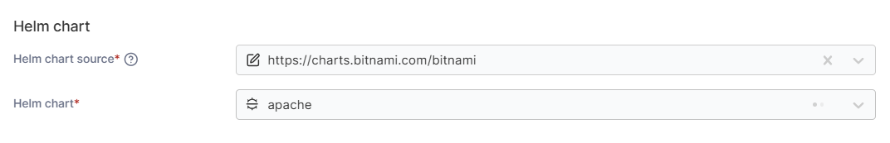
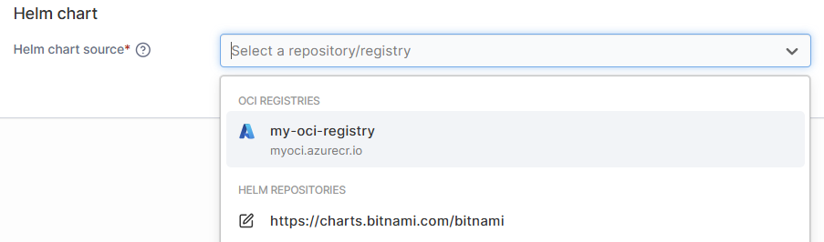
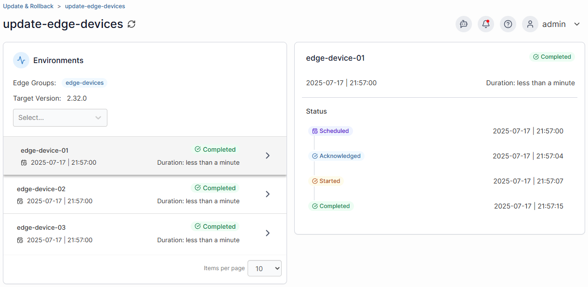
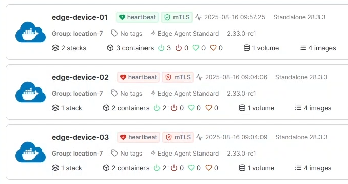

# What's new in version 2.33

Portainer version 2.33 includes a number of new fixes and updates, bringing the changes from the previous STS releases into the LTS stream. For a full list of changes, please refer to our [release notes](release-notes.md).



## Long Term Support (LTS)

2.33 is a Long Term Support, or "LTS", release of Portainer. LTS releases are intended to to be solid, tested, production-ready versions of Portainer, suitable for running in both testing and production environments. LTS releases generally do not have any additional features as compared to the previous STS release, but rather are a consolidation of all the new features and changes that have gone into the previous STS releases but with additional polishing and testing.

You can read more about our release principles in our [lifecycle policy](start/lifecycle.md).

## New features

### A new look   

The first change you'll notice in this release is a new look. We've updated and modernized the Portainer branding alongside this release, both in the application and on our website. We launched this new look in 2.32 and we've now brought it into our LTS release. These are the first iterations of this new branding, so expect to see more adjustments to this in subsequent releases.

<figure><figcaption></figcaption></figure>

### Experimental: Observability  

We introduced a new experimental feature in 2.32 - [Observability](user/observability/) - and this feature is now available within the LTS stream as well. With this prototype feature enabled, you can configure notifications to be sent on various conditions affecting your environments through various mechanisms (for example Slack, email, or via a webhook).

<figure><figcaption></figcaption></figure>

This feature is very much an [experimental feature](admin/settings/general.md#experimental-features), and as such we highly advise against enabling this on a production environment. We're keen to [get your feedback](https://github.com/orgs/portainer/discussions/12793) on the feature around what we can add or improve with it in future releases.

## Kubernetes

### Helm overhaul   

2.33 brings a brand new view of Helm deployments to Portainer. Clicking on a Helm deployment within the Applications list takes you to the new [Helm details](user/kubernetes/applications/inspect-helm.md) page, which provides a ton of information about the deployment's status and configuration. Here you can see the history of a Helm deployment through the Revisions list, upgrade your chart version, and roll back to a previous revision if things go wrong. You can now also compare the configuration between the current deployment and previous revisions to see exactly what has changed between deployments.

We've expanded the options available when deploying a Helm chart from a repository. You can now choose the repository to list charts from when deploying an app, choose the specific version of a Helm chart to deploy, and more easily make changes to any default values using the comparison display.

We've also streamlined the way that we retrieve charts from Helm repositories to improve load times, and we've added functionality around Helm chart versions to allow you to manually refresh the version list on-demand.

<figure><figcaption></figcaption></figure>

You can now also select chart sources for your deployments, allowing you to easily track where they came from and what changes you have made to your configuration compared to upstream sources.

<figure><figcaption></figcaption></figure>

Behind the scenes, we've switched to integrating the Helm SDK with Portainer, rather than our previous method of leveraging the Helm binary. Like the move away from the Docker Compose binary in previous versions, this change means one less vector for CVEs as well as improved performance and functionality.

### Support for OCI format Helm charts  

This release introduces support for OCI-format Helm charts via OCI registries to the LTS stream. These registries are configured in the same way as [image registries](admin/registries/), and any registries you currently have configured (and have given access to the respective namespace) that contain OCI charts will appear in the new Helm chart source dropdown when creating a deployment from Helm.

<figure><figcaption></figcaption></figure>

### Namespace Operator role  

There's a new RBAC role for Kubernetes users in this release: Namespace Operator. This role has the same permissions as the standard Operator role, but applied specifically to assigned namespaces instead of the entire cluster. This provides additional flexibility to administrators when providing access to resources on clusters.

## Edge

### Update & Rollback overhaul  

This release sees an overhaul of the [Update & Rollback](admin/environments/update.md) functionality for Edge devices. We've refreshed the UI and expanded the schedule detail view to provide much more information including per-device status reports so you can confirm that all devices in the group were updated as expected.

<figure><figcaption></figcaption></figure>

### mTLS improvements  

This release also brings a number of updates to our [mTLS functionality](advanced/mtls.md). We've added a new icon for environments on the dashboard that indicates the mTLS status where relevant.&#x20;

<figure><figcaption></figcaption></figure>

We've also improved the ability to view and manage your mTLS certificates from the UI rather than just the CLI, as well as fixed a few mTLS-related bugs. You can now view details of your mTLS certificates within the UI from the [Edge Compute settings](admin/settings/edge.md) as well as the mTLS status (and any errors) on individual environments from the home page.

## Docker

### Code completion and validation for Docker Compose   

To help users ensure their stack files are valid when being written and before deployment, we've introduced code completion and validation functionality to the [Web editor](user/docker/stacks/add.md#option-1-web-editor). If you've used Visual Studio Code or other IDEs that provide code hints, you'll be familiar with this kind of feature.

At present this functionality is available for Docker Compose only, but we hope to extend this to include validation for Kubernetes manifests in a future release.

## Enhancements and fixes

### Kerberos support for Active Directory authentication  

Portainer now supports Kerberos when [configuring Active Directory authentication](admin/settings/authentication/active-directory.md). You can choose between Simple and Kerberos bindings and configure the connection as required.

### Performance optimizations   

With every release we try to make using Portainer more responsive and performant, and this release is no exception. We continue to migrate more of our views to the React framework, and have made changes to how often we pull raw Docker snapshots, resulting in significantly faster load times. We've also made some adjustments to how systems work to reduce double-handling of data and in some cases drastically improve the load time of elements and data.
